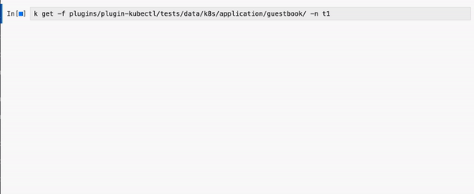
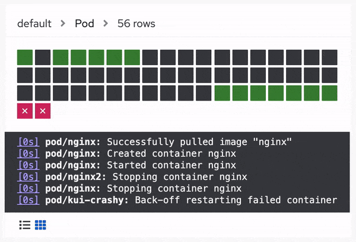
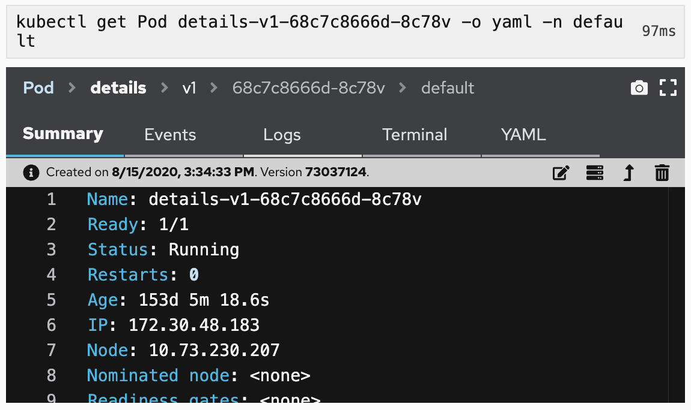
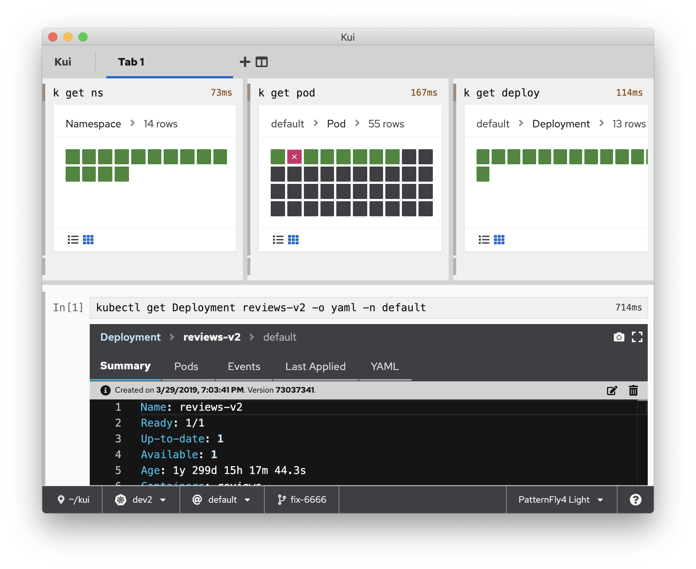

[](https://github.com/IBM/kui/stargazers)
[](https://github.com/IBM/kui/network/members)


[](https://opensource.org/licenses/Apache-2.0)
[](https://github.com/kubernetes-sigs/kui/actions/workflows/test.yaml)

[**Blogs**](https://medium.com/the-graphical-terminal) **|** [**PDF Summary**](docs/presentations/kui-cloudnative-devx-2021.pdf) **|** [**Installation**](#install) **|** [**API**](docs/api/README.md) **|** [**Custom Graphical CLIs**](#custom)

# Kui: a Framework for Enhancing CLIs with Graphics



We love CLIs, and think they are critical for interacting in a
flexible way with the cloud. We need the power to go off the
rails. But ASCII is tedious.

Kui takes your normal `kubectl` command line requests and **responds
with graphics**. Instead of ASCII tables, you are presented with
sortable ones. Instead of copying and pasting long auto-generated
resource names, in Kui **you just click**.

Kui is also fast. It launches in seconds, and can process `kubectl`
commands **2-3 times faster** than `kubectl` itself.



> Help us make Kubernetes tools better by filling out a [quick 2
> minute survey](https://forms.gle/BMvpscU9Yi5Horp29) on your tool
> preferences. Thanks!

<a name="install">

## Installing Kui for Kubernetes

We offer prebuilt images optimized for an enhanced Kubernetes CLI
experience.



#### MacOS (Intel and Apple Silicon)

```bash
brew install kui
kubectl kui get pods
open /Applications/Kui.app
```

#### Windows and Linux

[Download and
unzip](https://github.com/kubernetes-sigs/kui/releases/latest), then
add the unzipped directory to your PATH. Now use `kubectl kui` or
launch the `Kui` executable to use Kui's built-in REPL.

> **Windows Warning**: Please use forward slashes for filepaths, e.g. c:/users, not c:\users.

#### I don't trust the prebuilts

We hear you. Choose your platform (e.g. `mac:amd64`), execute the
following, then look in `./dist/electron`.

```sh
git clone git@github.com:kubernetes-sigs/kui.git && cd kui && npm ci && \
    npm run build:electron:mac:amd64
```

<a name="custom">

## I Want to Make a Custom Graphical CLI

Kui is a framework for adding graphics to CLIs. Kui allows for either
a hosted client-server architecture, or the distribution of
double-clickable applications (via [Electron](https://electronjs.org)).

Using the Kui framework, you can design your own Kubernetes
enhancements, set a custom theme or custom icon, and enhance the
commands of your favorite CLI. Check out the [template
repo](https://github.com/kui-shell/KuiClientTemplate). If your
enhancements would be generally valuable, please PR them back here,
e.g. awesome Kubernetes enhancements can be integrated with the [core
Kubernetes plugin](plugins/plugin-kubectl).

## Code of Conduct

Participation in the Kubernetes community is governed by the [Kubernetes Code
of Conduct](https://github.com/kubernetes-sigs/krew/blob/master/code-of-conduct.md).
