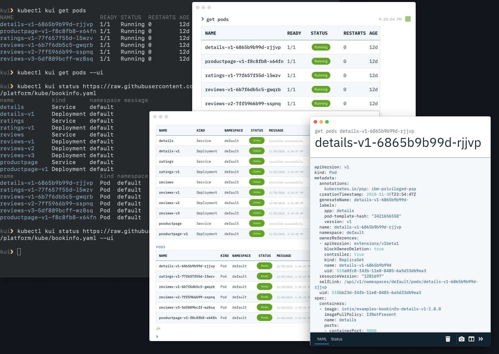

# Kui Shell

Kui Shell offers a new development experience for building
cloud-native applications. By combining the power of familiar CLIs
with visualizations in high-impact areas, Kui enables you to
manipulate complex JSON and YAML data models, integrate disparate
tooling, and provides quick access to aggregate views of operational
data.

## Quick Install

The fastest option is to install a prebuilt release.

[Kui-MacOS.tar.bz2](https://macos-tarball.kui-shell.org) **|** [Kui-Linux.zip](https://linux-zip.kui-shell.org)

Visit the [Kui Installation Guide](docs/installation.md)
for installation details and alternative installation options.

## Contributing

If you want to help, please take a look at our [guidelines](CONTRIBUTING.md) and [developer guide](docs/dev/README.md).

## The Kui Experience

Click the image to see [Kui in
motion](https://youtu.be/jcV0csyzGdY). For more of the backstory of
Kui, read on!

## This is a CLI, with Visualizations on the Side

Kui uses [Electron](https://electronjs.org) to provide you with an
augmented but CLI-focused development experience. By using Electron,
the same experience carries over, from local development on your
laptop, to a browser-based experience.

When running locally, you will have access to your filesystem and your
favorite terminal and text editor. To help with complex data, Kui
offers a suite of **visualizations**. You can gracefully flip between
the terminal and these visualizations, without having to switch to
your browser, log in, wait for pages to load, and navigate through
complex menu structures.

For example, to see a visual summary of your Kubernetes pods, issue
this command from your favorite terminal:

| Example Command             | Thumbnail of Output                                                                               |
| :-------------------------- | :------------------------------------------------------------------------------------------------ |
| `kubectl kui get pods --ui` |  |

Without the `--ui` option, Kui will display the output in your
terminal directly; you will observe that the output is identical to
that of `kubectl`, with the possible addition of syntax
coloration. With Kui, you have the power to navigate between these
modes in a graceful and flexible manner.

<a href="https://ibm.box.com/shared/static/55gasbz9fc40qrg43iq4b8t1uckupft4.gif">
    </img>
</a>

Now try clicking on a row. You should see the "sidecar" sweep in from
the right. This split screen mode allows you to drill down to the
details of your pods. You can click on one, then another, for rapid
inspection of several of your resources. The animated gif should give
you a sense of the possibilities (click on it to see a larger
version).

## Further Reading and Examples

Kui also has support for [Apache
OpenWhisk](https://github.com/apache/incubator-openwhisk) and [Apache
Composer](https://github.com/apache/incubator-openwhisk-composer/).
In all three cases, from Kubernetes, to serverless, to serverless
composition, the story is the same: you can gracefully transition into
the world of visualizations without altering your normal productive
workflows.

- [More Kubernetes Examples](docs/readme/examples/kubernetes.md)
- [Apache OpenWhisk Examples](docs/readme/examples/openwhisk.md)
- [Apache Composer Examples](docs/readme/examples/composer.md)
- [Creating your own Custom Kui Client](docs/dev/custom-clients.md)
