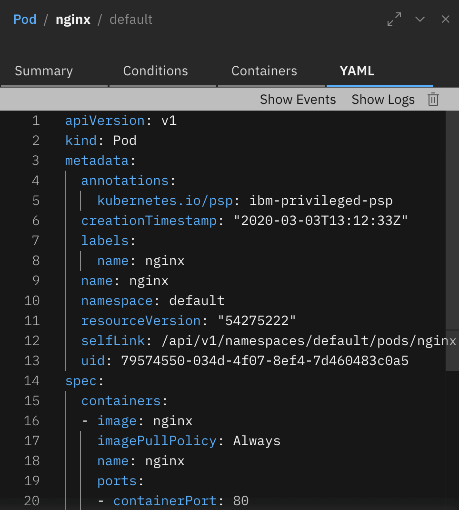
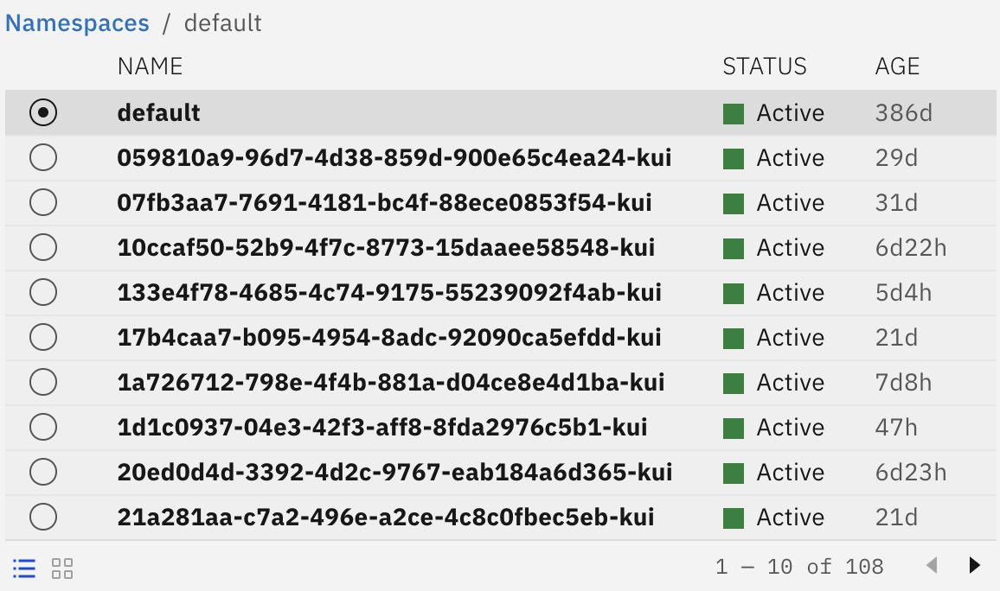
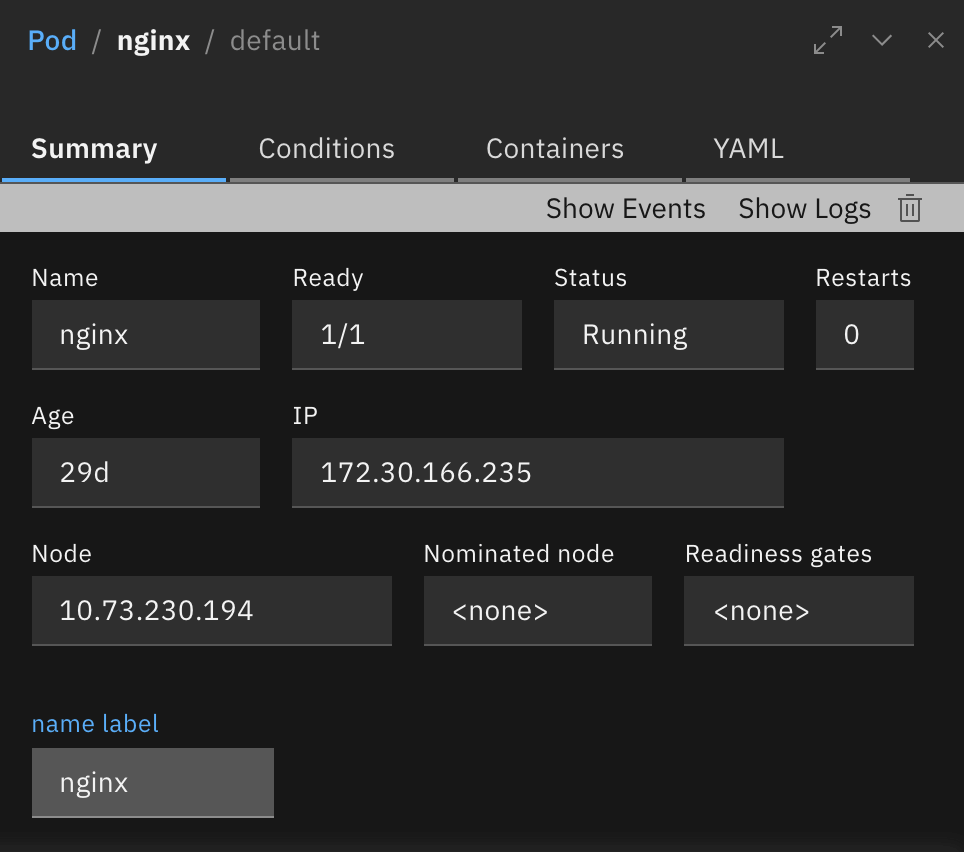
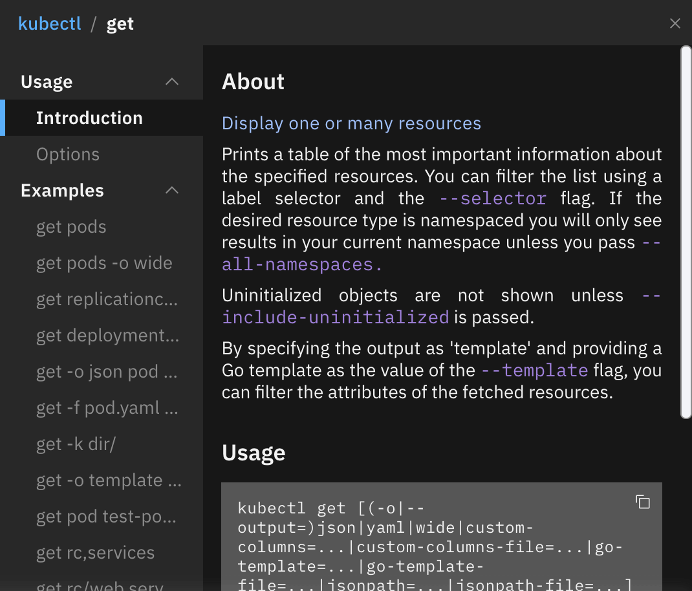
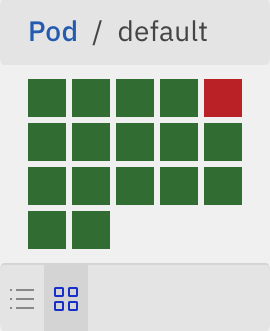

# The Kui Framework for Graphical Terminals

[](https://travis-ci.org/IBM/kui)
[](https://opensource.org/licenses/Apache-2.0)
[](https://codecov.io/gh/IBM/kui)
[](https://us-south.functions.cloud.ibm.com/api/v1/web/kuishell_production/kui/typecov-model.json)

Kui combines the power of familiar CLIs with visualizations in
high-impact areas. Kui enables you to manipulate complex JSON and YAML
data models, integrate disparate tooling, and provides quick access to
aggregate views of operational data.



## Installation

We offer prebuilt images that provide Kubernetes enhancements:

[Kui-MacOS.tar.bz2](https://macos-tarball.kui-shell.org) **|** [Kui-Linux-x64.zip](https://linux-zip.kui-shell.org) **|** [Kui-Win32-x64.zip](https://win32-zip.kui-shell.org)

To run Kui as a [kubectl
plugin](https://kubernetes.io/docs/tasks/extend-kubectl/kubectl-plugins/)
(for `kubectl` 1.12+), add the unpacked directory to your PATH;
e.g. on MacOS:

```bash
curl -L https://macos-tarball.kui-shell.org/ | tar jxf -
export PATH=$PWD/Kui-darwin-x64:$PATH
kubectl kui get pods
```

After the final command, you should see a popup window listing pods in
your current namespace. **Note:** On Windows, Kui currently has
kubectl plugin support for UNIX shells and PowerShell.

## Contributing

If you want to help, please take a look at our [guidelines](CONTRIBUTING.md) and [developer guide](docs/dev/README.md). If you want to develop your own custom client, using the Kui framework, check out the
[API docs](https://apidocs.kui-shell.org/).

## Kui is a CLI, with Visualizations on the Side


To help with complex data, Kui offers a suite of
**visualizations**. You can quickly flip between the terminal and
these visualizations, without having to switch to a browser, log in,
and navigate through complex menu structures.

Kui uses [Electron](https://electronjs.org) to provide you with an
augmented but CLI-focused development experience. You will have
access to your filesystem and your favorite terminal and text
editor. At the same time, one may offer a hosted Kui, allowing the
same experience in both a local- and browser-based experience.

  


## More Resources

- [API documentation for authoring new commands](https://github.com/IBM/kui/wiki/Authoring-Kui-Plugins)
- Kui can form the basis for delivering CLI-driven GUI experiences. For example, Kui has a custom client for Apache OpenWhisk: [Oui](https://github.com/kui-shell/oui#readme)
